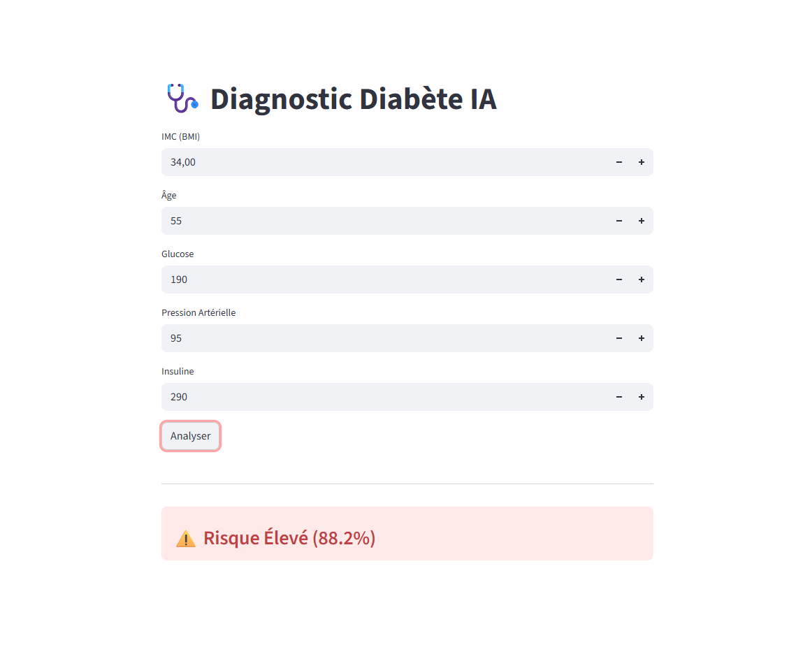
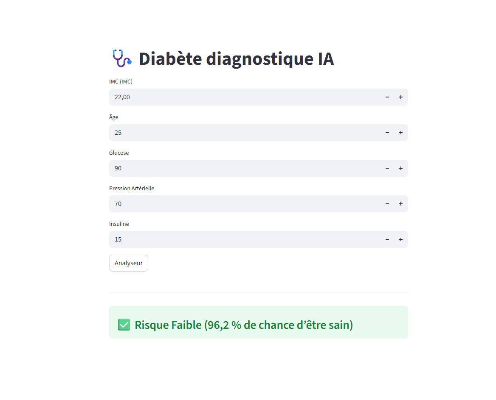

# 🩺 Diabetes Prediction Dashboard


## 📌 Présentation du Projet
Ce projet est une application d'**Intelligence Artificielle** destinée à aider au diagnostic précoce du diabète. Elle se base sur des données cliniques standard (Pima Indians Diabetes Dataset) pour évaluer la probabilité de risque chez un patient.

L'objectif était de construire une chaîne de traitement complète (Pipeline), du nettoyage des données jusqu'au déploiement d'une interface web interactive pour le corps médical.

## 🚀 Démo de l'Interface
## 📸 Aperçu de l'application

Voici à quoi ressemble l'interface :




> L'application permet une saisie intuitive des paramètres et fournit une réponse instantanée avec un indice de confiance (%).

## ⚙️ Architecture Technique

### 1. Préparation des Données
* **Sélection des features :** 5 variables clés ont été retenues pour leur impact prédictif :
  * Glucose (mg/dL)
  * IMC (Indice de Masse Corporelle)
  * Âge
  * Pression Artérielle (mm Hg)
  * Insuline (mu U/ml)
* **Normalisation :** Utilisation d'un `StandardScaler` pour harmoniser les échelles de valeurs et optimiser la performance du modèle.

### 2. Modélisation
Une approche comparative a été menée pour sélectionner le meilleur algorithme :

| Modèle Testé | Précision (Accuracy) | Verdict |
| :--- | :---: | :--- |
| **Régression Logistique** | **74.68%** | ✅ **Sélectionné** (Meilleure généralisation) |
| Random Forest | 72.00% | Non retenu (Léger surapprentissage) |

### 3. Interface Utilisateur
Développée avec **Streamlit**, l'application charge le modèle entraîné (`.pkl`) pour effectuer des prédictions en temps réel sans nécessiter de recalculs complexes.

## 📦 Installation et Utilisation (Utilisateur Final)

Si vous souhaitez simplement lancer l'application :

1. **Cloner le dépôt :**
```bash
git clone [https://github.com/boodem/diabetes-prediction-app.git](https://github.com/boodem/diabetes-prediction-app.git)
cd diabetes-prediction-app
```
2. **Installer les dépendances :**

```bash

pip install -r requirements.txt
```
3. **Lancer l'application :**

```bash
streamlit run app.py
```

## 🧬 Ré-entraînement du Modèle (Développeur)
Le code source de l'entraînement et les données brutes sont isolés dans le dossier training/.
Si vous souhaitez modifier le modèle :

  Accéder au Notebook : Ouvrez training/analyse_diabete.ipynb dans Jupyter ou VS Code.

  Lancer l'entraînement : Exécutez le notebook. Il va charger diabetes.csv, effectuer le scaling, et générer deux nouveaux fichiers : model_diabete.pkl et scaler.pkl.

  Mise en production : ⚠️ Important : Les nouveaux fichiers .pkl seront créés dans le dossier training/. Pour qu'ils soient pris en compte par l'application, vous devez les déplacer à la racine du projet, en écrasant les anciens fichiers.

## 📂 Structure du Projet
   ```plaintext
  Projet_Diabete_IA/
│
├── app.py                  # L'application Streamlit (Interface)
├── model_diabete.pkl       # Le modèle entraîné (Cerveau IA)
├── scaler.pkl              # Le scaler pour normaliser les entrées
├── requirements.txt        # Liste des librairies requises
│
└── training/               # 🧪 ZONE DE LABORATOIRE
    ├── analyse_diabete.ipynb  # Code source de l'entraînement
    └── diabetes.csv           # Données brutes
```